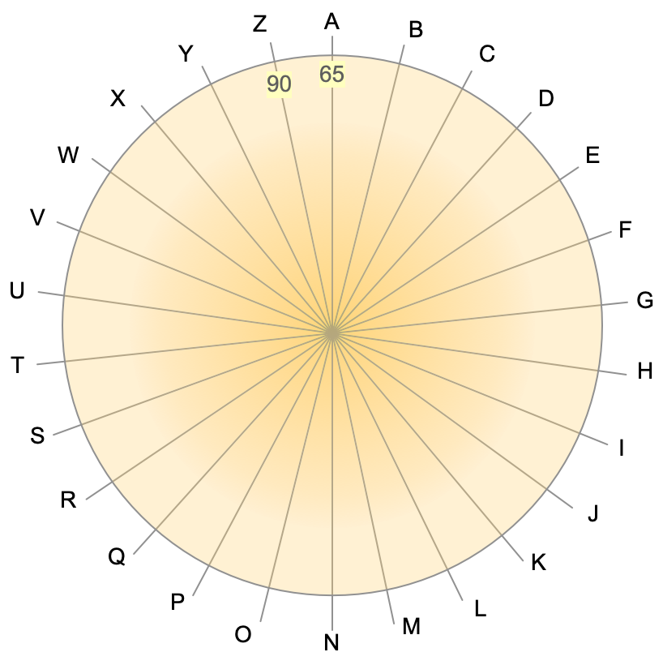
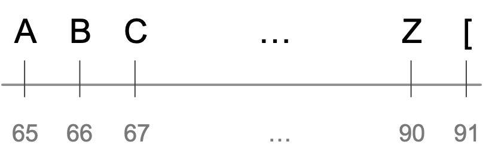

:orphan:

Caesar Cipher
=========================

 
Caesar's Cipher is a simple (and therefore not very safe) encryption technique. Its implementation is a good opportunity to discuss a few useful ideas. 

The implementation requires a method that accepts a string and an integer. The method transforms the string by shifting every letter by as many positions as indicated by the integer number. Then it returns the encoded string with the scrambled letters. For example, ``caesarCipher("HAL", 1)`` will result to ``"IBM"`` because ``'H'``, ``'A'``, and ``'L'`` will all be shifted one letter to the right. Based on that, we may rush to code something like this.

.. code-block:: java
   :linenos:
   
   public static String caesarCipher(String message, int key) {
       String encodedMessage = "";
       for (int i = 0; i < message.length(); i++)
           encodedMessage += (char) (message.charAt(i) + key);
       return encodedMessage;
   }  // method caesarCipher

The method above works well until we try something ``caesarCipher("Zoo", 1)``. The output will be ``"[pp"``. This is problematic, because we want letters to be replaced by other letters. Julius Caesar used letters only, and so must we. Encoding "Zoo" by shifting all letters one position to the right should yield "App". This implies that letter A is to the *right* of letter Z. But how is that possible? Z is the last letter of the alphabet; there is no letter to its right!

   
   The alphabet wheel. 

Instead of imagining the letters arranged along a line, it helps if we look at them positioned around a circle, as shown to the figure in the right. There are letters after Z. And there are letters before A!
(To keep things simple, we'll use upper case letters only from now on).

How do we model the alphabet wheel arithmetically? How do we show that moving *any* number of positions the right (or the left) of a letter, always returns a letter? For example, :math:`\text{'A'}+1 = \text{'B'}`, :math:`\text{'B'}+1 = \text{'C'}`,  :math:`\text{'Z'}+1 = \text{'A'}`, etc.

As we explore the properties of the alphabet wheel above, we begin to see a periodic pattern:

.. math::

   \text{'A'} + 1 = \text{'A'} + 27 = \text{'A'} + 53  = \text{'A'} + 90 =  \ldots 

The letter one place after 'A' is the same as the letter :math:`1+26` positions after 'A', and also :math:`1+(26+26)` positions, :math:`1+(26+26+26)` positions, and so on. If we start at 'A' and we make 90, 53, or 27 steps to its right, we'll always end up in the same place as if we had made only one step: at the letter 'B'. 

Similar results exist for the other letters in the alphabet wheel. This behavior can be summarized in the following table. The first row is the number of steps we make to the right of the letter shown in the first column. The corresponding cell shows the letter we end up with. For example, :math:`\text{'B'}+2 = \text{'D'}`. The numbers in parentheses are the numeric codes for the letters (the `ASCII <https://en.wikipedia.org/wiki/ASCII>`__ values).

+--------------+---------+---------+-----+---------+
|              | **1**   | **2**   | ... | **26**  |
+--------------+---------+---------+-----+---------+
| **A (65)**   | B (66)  | C (67)  | ... | A (65)  |
+--------------+---------+---------+-----+---------+
| **B (66)**   | C (67)  | D (68)  | ... | B (66)  |
+--------------+---------+---------+-----+---------+
| ...          | ...     | ...     | ... | ...     |
+--------------+---------+---------+-----+---------+
| **Z (90)**   | A (65)  | B (66)  |     | Z (90)  |
+--------------+---------+---------+-----+---------+

In  general, periodic behavior among discrete, finite items is an indication of a `modulo operation <https://en.wikipedia.org/wiki/Modulo_operation>`__. Letters are discrete (there is nothing between them) and finite (only 26). The alphabet wheel repeats itself with a period of 26. And so we can write

.. math:: 

   \text{letter} + m = \text{letter} + (m\bmod 26) 

Variable :math:`m` above corresponds to variable ``key`` in the method we are trying to build: the amount by which we shift letters to the right (or to the left if ``key`` is negative). In Java parlance:

.. code-block:: java

   int newLetter = currentLetter + (key%26)

If only it were that simple! This formula works on the alphabet wheel because it tells that the letter 27 steps to the right of Z is still A. On a circle. Computers, however, are very linear things.

   
   The alphabet line. 

The cyclic approach tells us that one step to the right of Z is the letter A. But in the linear way that computers arrange symbols (like the ASCII code), one place to the right of Z we find the opening square bracket ``[``. The simple expression :math:`m\bmod 26` (or, ``key%26`` in Java), cycles through :math:`\{0,1,\ldots,25\}`. In programming, we are interested in cycling through :math:`\{65, 66, \ldots, 90\}`; these are the ASCII values that correspond to letters A through Z.

The desired cycling can be obtained by the expression :math:`65+(m\bmod 26)`. Any value of :math:`m` will return a value between 65 and 90, inclusive. 

Now that we have an expression to stay within the ASCII codes for letters A through Z, we can use it for our cipher. The cipher replaces a letter with another letter, ``key`` positions away. If the letter's ASCII value is stored in variable``c``, we want the expression ``c+key`` to stay between 65 and 90. The corresponding Java expression will be

.. code-block:: java

   int newLetter = 65 + (c + key - 65)%26;

The expression above ranges between 65 and 90, inclusive, and so it corresponds to a letter between A and Z. Let's demonstrate this with an example. If ``c=90`` (the letter Z) and we want to obtain the letter immediately to its right, so ``key=1`` and the sum ``c+key`` is 91. Subtracting 65 yields 26 and 26%26 is 0, so ``newLetter`` will be ``65+(90+1-65)%26`` which is ``65+0``, i.e., the code for the letter A. 

What we have done here is to write an expression that finds the ciphered value for any letter, as a number of steps after the letter A. We always start with the letter A (65) and we add to it the number of steps we make to the right (or left) to find the new letter. That number of steps is always between 0 and 25.

.. code-block:: java

   /**
    * Encrypts a string with a simple shift algorithm. This implementation works in upper case
    * only, by transforming the input message to upper case.
    * @param message String to encrypt
    * @param key int for shifting letters
    * @return string with encrypted message
    */
   public static String caesarCipher(String message, int key) {
       // These variables can be moved outside the method as class constants.
       final int ASCII_A = (int)'A';  // ASCII value for letter A
       final int ASCII_Z = (int)'Z';  // ASCII value for letter Z
       final int alphabetLetters = 1+ASCII_Z-ASCII_A;  // Number of letters in the alphabet
       // Bring input message to upper case
       message = message.toUpperCase();
       // Initialize output string
       String encodedMessage = "";
       // Loop over every character in the input string
       for (int i = 0; i < message.length(); i++) {
           int c = (int) message.charAt(i);
           // Is this a letter character?
           if (c >= ASCII_A && c <= ASCII_Z) {
               // Shift c to its new position
               c = ASCII_A + (c+key-ASCII_A)%alphabetLetters;
           }
           // Add c to the output message
           encodedMessage += (char) c;
       }
       return encodedMessage;
   }  // method caesarCipher