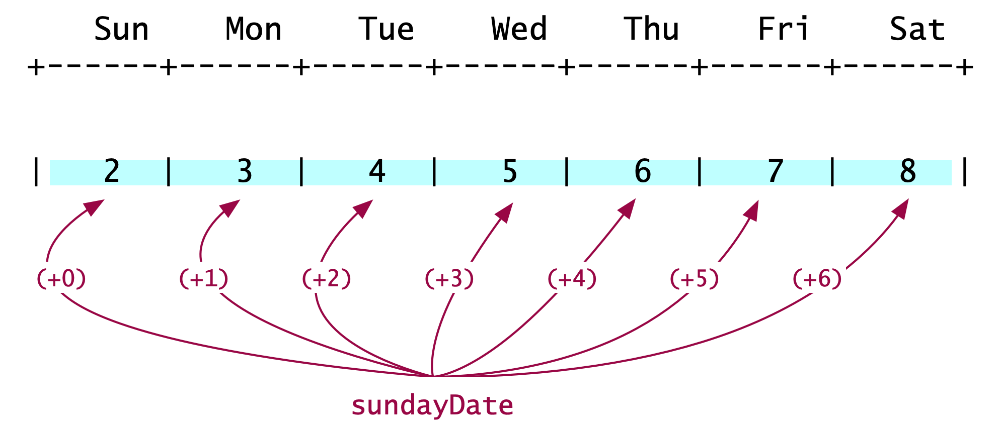

:orphan:

The Calendar Problem
=====================

The calendar problem is seemingly a difficult one. There are several different scenarios and we do not really know how to navigate them. One way to navigate different scenarios in programming is to use conditional statements, like `if-then-else`. At this stage in the course however, we have not "discovered" conditionals. And it is worth trying to solve the problem without looking ahead in the course material.
   
Solving the calendar problem without conditional statements is a fantastic learning moment. A solution without conditional statements requires some serious analysis first, illustrating that most computing problems follow the 80-20 rule: 80% thinking, 20% coding. The analysis begins by turning off our IDE, moving our focus from coding to thinking. Next, we draw a few scenarios on paper, on a notes app, whatever works for you. 

.. figure:: images/Calendar.png
   :figwidth: 60%
   :align: right
   
   A 31-day month with Sunday as its **second** day. 

As we try different combinations, e.g., 31-day month whose first day is a Sunday, or a 28-day month whose first day is a Tuesday, etc, we begin to see a pattern like the one to the right. The lines of the calendar are separated into three groups. The first group (yellow) *may* have a few empty spaces in the front. The second group (blue) has every space filled with a date. And the third group (green) *may* have a few empty spaces at the back.

The "blue" week
+++++++++++++++

   
   Printing the "blue" week. 

The middle group (blue), shown to the left, may be the easiest to describe. It prints the dates for a full week, starting with Sunday. It adds 1 for every subsequent day. We do this for as many days as there are in a week (hint: 7). This is an operation easily implemented with a for-loop. Let's call the loop's variable :math:`\texttt{day}`; its range will be :math:`0\leq\texttt{day}<7`. 

The code now becomes straight forward. We need a method that prints seven numbers, starting with the date of the that week's Sunday. That date is assigned to ``int sundayDate``. The first value of the loop variable is 0 and so ``sundayDate+0`` prints the date of that week's Sunday. The constant ``DAYS_IN_A_WEEK`` is assigned the value 7, to make our code more descriptive.

.. code-block:: java

   public static void blueWeek(int sundayDate) {
     for ( int day = 0;  day < DAYS_IN_A_WEEK; day++ ) {
       // print the date: sundayDate + day;
     }
   }

The "yellow" week
+++++++++++++++++

.. figure:: images/yellow.png
   :figwidth: 60%
   :align: right
   
   Printing the "yellow" week. 
   
Next let's look at the first line of the calendar, the "yellow" week. After a bit of head-scratching, we observe that the yellow week comprises two groups. A group of empty cells (in orange outlines) and a group of filled cells (pink outline). The total number of cells in these two groups is always 7 (``= DAYS_IN_WEEK``).

Can we tell how many cells are in each group? In the example here, we see that if the first Sunday of the month is its second day, there are 6 empty cells. Pretty soon, we can see that the number of empty and filled cells for the yellow line depends on the date of the first Sunday of the month. The best formula for computing the number of blank cells is:

.. math::

  \text{number of blank cells} = (8 - \text{first Sunday}) \bmod 7
  
Parameterizing :math:`D=7` as the variable with the number of days in the week, the expression above becomes:

.. math::

  \text{number of blank cells} = ((D+1) - \text{first Sunday}) \bmod D

The corresponding Java statement (line 124 in the code below) uses the constant ``DAYS_IN_WEEK`` instead of :math:`D`, and becomes:

.. code-block:: java

   int blanksAtBeginning = ((DAYS_IN_WEEK +1) - firstSunday) % DAYS_IN_WEEK;

Remaining analysis and observations
+++++++++++++++++++++++++++++++++++

The analysis above can be used to determine how to print the "green" week and the "blue" weeks. And the final code will take the following form:

::

    print yellowWeek
    print blueWeek // \
    ...            //   Do this 3 - 4 times
    print blueWeek // /
    print greenWeek

To determine the ``greenWeek`` method and the number of times we invoke ``blueWeek``, it's important to realize the importance of the ``yelloWeek``.  It tells us how many days are printed on the first row of the calendar. i And so, it tells us how many days are left to be printed. We can use that information to determine how may of ``blueWeek`` calls we need and also how many days to print in a ``greenWeek`` -- if one is needed.

Let's close with an **observation.** The problem starts with the requirement to not use conditional statements. To be precise, what we have avoided so far is the explicit use of `if-then-else` statements. Because our code will contain for-loops, there will be *implied* conditions: the loops' terminating conditions. It can also be argued that the modulo operator represents a conditional evaluation.

The KF code
+++++++++++

The best solution, to date, for this problem came from KF, a student who took COMP 170 in Spring 2021. Her code is shown below. I have only made style and commend edits, and added a few class constants. Also, I added one if-statement in spite of the problem forbiting us to use them. The if-statement is not related to the construction of the calendar grid, but makes sure that the arguments we pass are valid. In other words, if we ask for the calendar of a month with 43 days, whose first Sunday is the 11th day in the month, nothing will appear on our screens.

.. code-block:: java
   :linenos:

   /**
    * Class that creates a monthly calendar on a grid with 7 columns. Each column corresponds to a day of
    * the week, beginning with Sunday.
    *
    *              Sun    Mon    Tue    Wed    Thu    Fri    Sat
    *            +------+------+------+------+------+------+------+
    *            |      |      |      |      |      |      |      |
    *            +------+------+------+------+------+------+------+
    *
    * The first row of the grid may include empty cells until the first day of the month is marked. The two extreme
    * scenarios are when the first day of the month is Sunday or Saturday:
    *
    *              Sun    Mon    Tue    Wed    Thu    Fri    Sat           There are no empty cells
    *            +------+------+------+------+------+------+------+        in the grid for the first
    *            |  1   |  2   |   3  |  4   |  5   |  6   |  7   |        week when the first day of
    *            +------+------+------+------+------+------+------+        the month is Sunday
    *
    *
    *              Sun    Mon    Tue    Wed    Thu    Fri    Sat           There are 6 empty cells
    *            +------+------+------+------+------+------+------+        in the grid for the first
    *            |      |      |      |      |      |      |  1   |        week when the first day of
    *            +------+------+------+------+------+------+------+        the month is Saturday
    *
    * Once we determine the occupancy of the grid for the first week, the grids for the remaining weeks can be
    * computed easily.
    *
    * The code to compute correctly the contents of the grid for the first week of the month, was developed by KF,
    * a student in COMP 170, Spring 2021. Leo Irakliotis rewrote the code to introduce class constants and additional
    * comments.
    *
    */
   public class Calendar {

       /** Number of days in shortest month */
       public static final int SHORTEST_MONTH = 28;
       /** Number of days in longest month */
       public static final int LONGEST_MONTH = 31;
       /** Number of days in a week */
       public static final int DAYS_IN_WEEK = 7;
       /** Size of cell padding */
       public static final int PADDING = 5;
       /** Grid header */
       public static final String DAYS_NAMES = "  Sun    Mon    Tue    Wed    Thu    Fri    Sat   ";

       /** Driver method to test the code. */
       public static void main(String[] args) {
           // A few test calls
           printCalendarMonth(6, 30);
           printCalendarMonth(3, 31);
           printCalendarMonth(1, 28);
           printCalendarMonth(3, 30);
           printCalendarMonth(7, 31);
       }  // method main

       /**
        * Method to produce the calendar, by calling other methods for various parts of the calendar.
        * @param firstSunday int date of the first Sunday of the month
        * @param numberOfDays int number of days in the month.
        */
       public static void printCalendarMonth (int firstSunday, int numberOfDays){
           // Valid arguments: Month has 28, 29, 30, or 31 days? First Sunday on 1st-thru-7th day?
           boolean argumentsAreValid = (numberOfDays >= SHORTEST_MONTH && numberOfDays <= LONGEST_MONTH) &&
                   (firstSunday > 0 && firstSunday <= DAYS_IN_WEEK);
           if (argumentsAreValid) {
               printHeader();
               printBlankDaysBeg(firstSunday);
               printFirstWeek(firstSunday);
               printOtherWeeks(firstSunday, numberOfDays);
               printLastWeek(firstSunday, numberOfDays);
               printBlankDaysEnd(firstSunday, numberOfDays);
               separator();
           }
       }  // method printCalendarMonth

       /**
        * Method to print a calendar header showing the days of the week, followed by a separator line.
        */
       public static void printHeader(){
           System.out.println(DAYS_NAMES);
           separator();
       }  // method printHeader

       /**
        * Method to print a line with spacing marks to indicate a grid pattern.
        */
       public static void separator(){
           System.out.println("+------".repeat(DAYS_IN_WEEK) + "+");
       }  // method separator

       /**
        * Prints the number of blank days at the beginning of the calendar. To compute how many blank dates (and
        * therefore blank cells) needed, we obseeve that when the first Sunday falls on the first day of the month
        * there are 0 blank cells, is Sunday is the 2nd day of the month, there are 6 empty cells and so on. These
        * observations are summarized below, leading to the expression that computes the number of empty cells.
        *
        * if first Sunday          there are this          expression to generate
        * falls on this            many blank cells        the number of empty
        * day of the month         in first week           cells required
        *
        *      1                           0               (8-1) % 7 = 0
        *      2                           6               (8-2) % 7 = 6
        *      3                           5               (8-3) % 7 = 5
        *      4                           4               (8-4) % 7 = 4
        *      5                           3               (8-5) % 7 = 3
        *      6                           2               (8-6) % 7 = 2
        *      7                           1               (8-7) % 7 = 1
        *
        * Based on the observation above, we can compute the number of blank cells with the formula:
        *
        *      blankCells = (8 - firstSunday) % 7
        *
        * and since we have a constant daysInWeek to represent number seven, the formula is rewritten:
        *
        *      blankCells = ( (daysInWeek + 1) - firstSunday )  %  daysInWeek
        *
        * @param firstSunday int date of first Sunday of the month
        */
       public static void printBlankDaysBeg(int firstSunday){
           int blanksAtBeginning = ((DAYS_IN_WEEK +1) - firstSunday) % DAYS_IN_WEEK;
           System.out.print("|      ".repeat( blanksAtBeginning ) + "|".repeat(Math.min(firstSunday-1, 1)));
       }  // method printBlankDaysBeg

       /**
        * Prints the first week, taking into account the number of blanks at the beginning of the month
        * @param firstSunday int date of first Sunday of the month
        */
       public static void printFirstWeek(int firstSunday){
           // Print squares with dates in them, continuing on the same line as printBlankDays
           for (int day = 1; day <= firstSunday - 1 ; day++) {
               System.out.print(padded(day, PADDING) + " |");
           }
           // Only go to a new line if we printed anything in the first loop.
           // If not, our first week stars on Sunday and it will be taken care of by printOtherWeeks.
           for (int j = firstSunday; j > 1; j = j - 100) {
               System.out.println();
           }
       }  // method printFirstWeek

       /**
        * Prints the more standard weeks
        *
        * @param firstSunday int date of the first Sunday of the month
        * @param numberOfDays int number of days in the month.
        */
       public static void printOtherWeeks(int firstSunday, int numberOfDays){
           // Tells us the number of weeks we'll need, since if 7 doesn't divide evenly into our numberOfDays
           // we need to round it up to print the final, shorter week
           int numberOfRows = (int) Math.ceil((numberOfDays - firstSunday + 1) / ((double) DAYS_IN_WEEK));
           for (int week = 0; week < numberOfRows - 1 ; week++) {
               // Adds 7 to firstSunday to give us the first day of each week
               int firstDayOfWeek = firstSunday + (week * DAYS_IN_WEEK);
               // The last day of the week is whichever is smaller, the total numberOfDays in the month
               // or the Saturday of that week. This takes care of what happens if the month ends in the middle of a week.
               int lastDayOfWeek = Math.min((firstSunday + (week * DAYS_IN_WEEK) + (DAYS_IN_WEEK -1)), numberOfDays);
               // left edge formatting
               System.out.print("|");
               // This loop prints the days in padded formatting
               for (int day = firstDayOfWeek; day <= lastDayOfWeek ; day++) {
                   System.out.print(padded(day, PADDING) + " |");
               }
               System.out.println();
           }
       }  // method printOtherWeeks

       /**
        * Prints the final week of the calendar
        *
        * @param firstSunday int date of the first Sunday of the month
        * @param numberOfDays int number of days in the month.
        */
       public static void printLastWeek(int firstSunday, int numberOfDays){
           int numberOfRows = (int) Math.ceil((numberOfDays - firstSunday + 1) / ((double) DAYS_IN_WEEK));
           System.out.print("|"); // left edge formatting
           for (int day = firstSunday + ((numberOfRows - 1) * DAYS_IN_WEEK) ; day <= numberOfDays; day++) {
               System.out.print(padded(day, PADDING) + " |");
           }
       }  // method printLastWeek

       /**
        * Prints the blank days at the end of the calendar.
        * @param firstSunday int date of the first Sunday of the month
        * @param numberOfDays int number of days in the month.
        */
       public static void printBlankDaysEnd(int firstSunday, int numberOfDays){
           int blanksAtBeginning = (((DAYS_IN_WEEK +1) - firstSunday) % DAYS_IN_WEEK);
           /*
           This is just like our other int numberOfRows used earlier, except for the Math.min statement at the end
           which adds an additional row iff we have any blanks at the beginning. We need it to do this otherwise it will
           print one extra row at the bottom if the firstSunday is 1.
           */
           int numberOfRows2 = (int) Math.ceil((numberOfDays - firstSunday + 1 ) / ((double) DAYS_IN_WEEK)) + Math.min(blanksAtBeginning, 1);
           /*
           The repeat statement comes from the fact that the total number of squares in the calendar (numberOfRows2 * 7)
           minus the total numberOfDays and blanksAtBeginning will tell us how many leftover squares we have at the endt
           hat need to be printed blank.
           */
           System.out.println("      |".repeat((numberOfRows2 * DAYS_IN_WEEK) - (numberOfDays + blanksAtBeginning)));
       }  // method printBlankDaysEnd

       /**
        * Helper method provided by the book assignment
        * @param n int Number to display in padded string
        * @param width int width of the string
        * @return String with padded content
        */
       public static String padded (int n, int width){
           String s = "" + n;
           for (int i = s.length(); i < width; i++) {
               s = " " + s;
           }
           return s;
       }  // method padded

   }  // class Calendar
   

