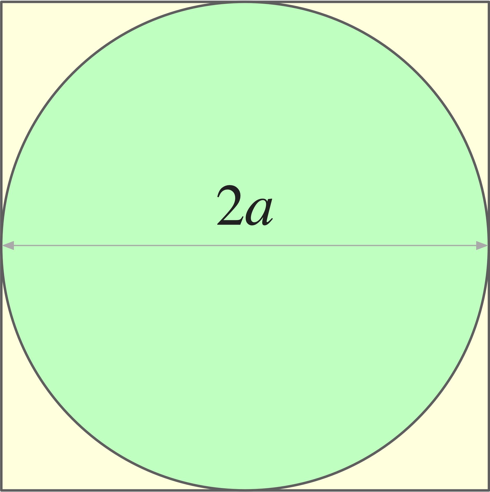
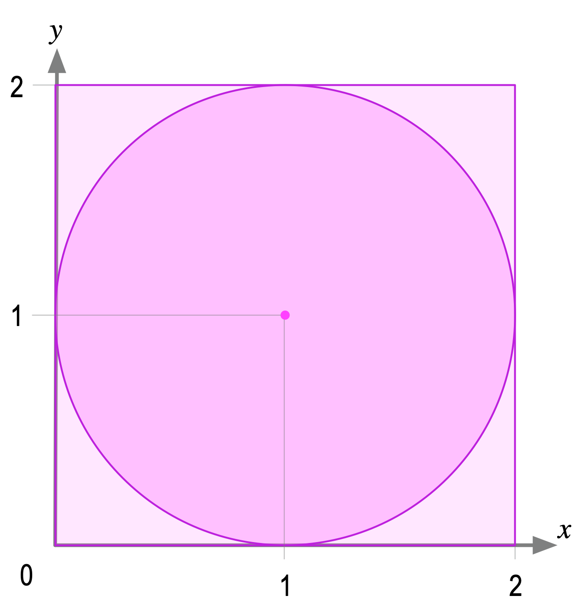

:orphan:

Computing pi (on pi day!)
=========================

 
In observance of **Pi Day** (March 14), we worked out a numerical computation of the number :math:`\pi`.

   
   A circle inscribed in a square. 

We started with the observation that a circle inscribed in a square covers :math:`\pi/4` of the square's surface. Consider the arrangement shown to the right. We have a square whose edge has length :math:`2a`. Its surface area is :math:`4a^2`. A circle inscribed in that square, has a diameter also :math:`2a` and therefore a radius :math:`a`. The surface of the circle is :math:`\pi r^2` or, in this case, :math:`\pi a^2`. 

The fraction of the square's surface covered by the circle is given by:

.. math::

   \frac{\text{area of circle with radius}\ r=a}{\text{area of square with edge}\ 2a} = \frac{\pi a^2}{4a^2} = \frac{\pi}{4}

Any point inside the square has a :math:`\pi/4` chance of also being inside the circle. And if we consider a sufficient number of points inside the square, at random, we expect about :math:`\pi/4` of them to be inside the circle. In other words: we have a way of computing :math:`\pi` by throwing random points inside a square surface! The process is simple::

   using a square with an inscribed circle:
   N <-- number of points thrown at random, inside square
   M <-- number of points inside circle
   return 4*(M/N) as approximation of pi

The first thing we need to do is to set up the square with an inscribed circle, in a way that we can manipulate computationally. Next we need a way to tell if a random point inside a square is also inside the circle. And, of course, we need a way to generate random numbers.

   
   Setting up the computational model we need. 
   

The geometric set up is straight forward, and shown to the right. If our square has an edge with length :math:`2a`, the inscribed circle has a radius of :math:`a`. If we place these shapes at the center of :math:`x`-:math:`y` axes, any point inside the square can be described by coordinates :math:`(x, y)` such that :math:`-a\leq x\leq a` and :math:`-a\leq y\leq a`.

Consider a point inside the square as shown in the figure. This point, at :math:`(x_1, y_1)` is also inside the circle. The distance of any point from the center is given by the Pythagorean theorem; in the case of the point at :math:`(x_1, y_1)`, that distance is :math:`z_1 = \sqrt{x_1^2+y_1^2}`. We can tell that the point is inside the circle because :math:`z_1 \leq a`.

Now, we can begin putting together some code in Java.

.. code-block:: java

   public static double pi(int N) {
     int M = 0;  // how many points inside circle
     for (int i=0; i < N; i++) { // loop to throw N points
       // x = random number anywhere from -a to a
       // y = random number anywhere from -a to a
       double z = math.sqrt(x*x+y*y);  // distance of random point (x,y) from center
       if (z <= a)  // is distance less than radius?
         M++; // point is inside circle; count it.
     }
     return 4.0*((double)M/(double)N);  // approximate value of pi
   }

The last thing we need to analyze is how to find a random number in the interval from :math:`-a` to :math:`a`. Java can generate random numbers in the range from 0 to 1. The transform we want, should work as follows:

+--------------------+------------------------------------------------+
| Java random number | random number between :math:`-a` and :math:`a` |
+--------------------+------------------------------------------------+
| 0                  | :math:`-a`                                     |
+--------------------+------------------------------------------------+
| 1/2                | 0                                              |
+--------------------+------------------------------------------------+
| 1                  | :math:`a`                                      |
+--------------------+------------------------------------------------+

This can be accomplished with the following expression:

.. math::

   (\text{random number from} -a\ \text{to}\ a)\ =\ -a +2a\rho

where :math:`\rho` is a Java-generated random number. The final code is shown below.

.. code-block:: java
   :linenos:
 
   /**
    * Computes pi by throwing N points, at random, inside a square and counting how many 
    * fall within an inscribed circle.
    * 
    * @param N int number of random points to throw inside the square
    * @return an approximate value of pi
    */
   public static double pi(int N) {
       // Set up a random number generator
       Random rng = new Random();
       // Radius of inscribed circle; also determines size of square
       double r = 1.0;
       // Initialize counter of points inside circle
       int M = 0;
       // Set up loop to try N random points
       for (int i = 0; i < N; i++) {
           // Obtain coordinates for random point
           double x = -r + 2.0*r*rng.nextDouble();
           double y = -r + 2.0*r*rng.nextDouble();
           // Distance of random point from center
           double z = Math.sqrt(x*x+y*y);
           // If this point is within circle, update count
           if (z <= r)
               M++;
       }
       return 4.0*((double) M/(double) N);
   }  // method pi

Casting both ``M`` and ``N`` as ``double`` variables in the return statement is a bit redundant. It suffices to cast as ``double`` only one of them. Nevertheless, it makes the code appear more purposeful, at least in my eyes.